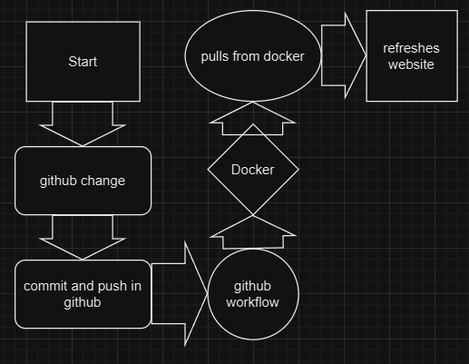

# Jeremy Hackman

### 12/2/2024

# Project 4

## Docker & GitHub Actions and DockerHub
### Documentation

# Project Overview

- The main point of this project is to make a container for an angular application using docker and CI which is continous integration with github. This can help make repeatable environments for later apps and containers. the tools that were used in this project are, Docker, Angular, and Github. I used Docker for container storage and Angular as it was the given framework for this project and I used Github for the CI that was needed for the project.

-  

- Include a diagram (or diagrams) of your entire workflow. Meaning it should start with a project change / update, the steps that happen in between, and end with the updated version when the server is queried (web page is accessed)

# Run Project Locally

- I installed docker via the docker website, dockerhub and downloaded docker desktop to assist in the project. I also made sure to make the account to the project specifications as i was having some issues with docker a few weeks ago.

- The first step would be to create the Dockerfile, with pieces like, `FROM, WORKDIR, COPY, RUN, COPY, EXPOSE, CMD and any others`. Than build the image with `docker build -t name/angular-site .`. Than you should run the container to see if it works and us the command, `docker run -p portnumber:portnumber name/angular-site`. Than lastly, you should push the image to dockerhub using the command `docker push name/angular-site`.

- To run and test a container you should follow the testing step that was used above, by using the commadn `docker run -p portnumber:portnumber name/angular-site`. This should set it up to run, and to test that you can use `http://localhost:portnumber` to check it, or verify with `docker ps`. 

# DockerHub

- The process to make a public repo in DockerHub is quite simple. Firstly make an account, once an account has been made make sure when you are making the repo public that you click public and follow the directions and everythinvg should run smoothly.

- To authenticate with DockerHub via CLI using Dockerhub credentials, one should enter into their own repo, and use `docker login` to enter credentials input, next step would be to enter said credentials, your `Username:    ` and your `Password:   ` Once said username and password are entered for DockerHub, it should clarify and say that you have been logged in, or it will show an error.

- The only credentials truly needed are the Username and Password to DockerHub as once said credentials are made, and placed they should be saved to your device so on and so forth.

- The method to push to DockerHub is quite simple as well, simply log in, and enter the code `docker push username/repositoryname:tag` and it will work, just check docker to make sure.

- My DockerHub Link is `https://hub.docker.com/u/hackmanmeme`.

# GitHub Actions

- Configuring GitHub Secrets
  - The `DOCKER_USERNAME`, was set using the dockerhub username that was made `hackmanmeme` and the `DOCKER_TOKEN`, was generated using the given Token.

- Behavior of GitHub workflow
  - The workflow is triggered when changes are made to the main branch or when a pull request is made. It checks the code out and builds a docker image from the dockerfile, than the image is tagged with my username and the given tag, and pushed to docker hub.

  - The custom variables are four seperate variables, them being, `${{ secrets.DOCKER_USERNAME }}`, `${{ secrets.DOCKER_TOKEN }}`, `angular-site`, and `v1.0`. The first being the docker username, the second being the token for docker, the third would be the name of the docker image, which i dont know if it was supposed to be angular site, but thats what it turned out to be, and lastly would be version 1.0, saying that this was the first version.

